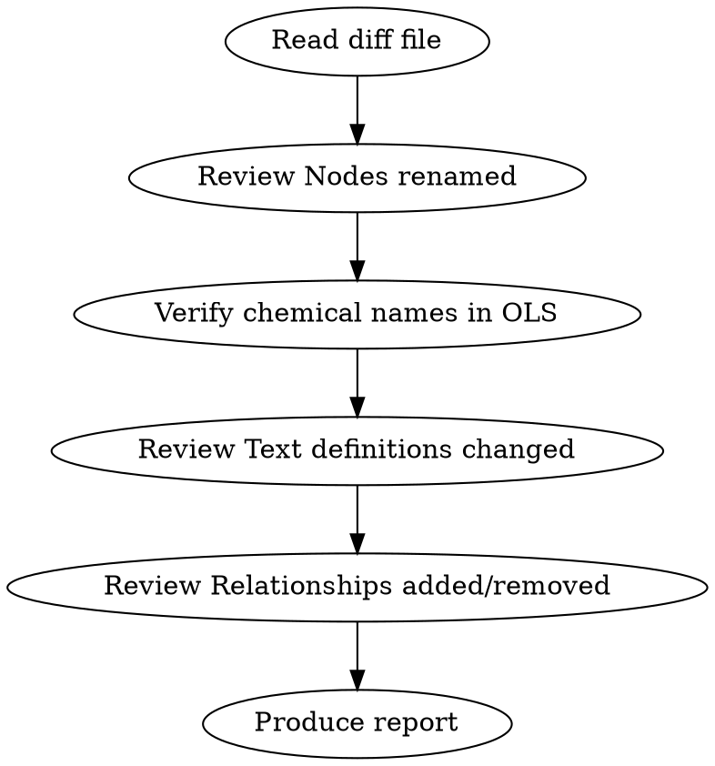

# Review HPO Chemical Phenotype Diff

Review `reports/hp_chemical_phenotype_diff.md` — the output of the HPO chemical phenotype EQ normalisation pipeline — to verify renames do not change term semantics.

## Context

The diff is generated by `sh run.sh make hpo_phenotype_pipeline -B`. **Never run this yourself — always ask the user to run it.**

The pipeline:
1. Downloads a normalisation spreadsheet (`$(TMPDIR)/normalised_patterns.tsv`) mapping HP terms to DOSDP patterns
2. Generates new labels/definitions/EQs from DOSDP patterns
3. Applies SPARQL label replacements (`../sparql/update-chemical-labels.ru`) — these handle known synonym mappings (e.g. "serotransferrin" → "transferrin", "mucin-16" → "CA-125", ion charge stripping like "calcium(2+)" → "calcium", enzyme "concentration" → "activity")
4. Merges old labels as exact synonyms
5. Diffs old vs new using OAK

**Key source files for tracing issues:**
- `$(TMPDIR)/normalised_patterns.tsv` — the input spreadsheet driving the rename
- `../sparql/update-chemical-labels.ru` — SPARQL-based label transformations
- `$(PATTERNDIR)/dosdp-patterns-hpo/*.yaml` — DOSDP pattern templates

## Workflow



1. **Read the diff file** — default path: `reports/hp_chemical_phenotype_diff.md`
2. **Review "Nodes renamed"** — primary focus (see classification below)
3. **Verify suspect chemical names via OLS** — when a chemical entity name changed, use OLS MCP `search` or `searchClasses` to confirm the new name is a valid synonym of the old name in CHEBI or the relevant source ontology
4. **Review "Text definitions changed"** — check for meaning drift, especially:
   - "concentration" → "activity" changes (should only happen for enzymes, per the SPARQL rule)
   - Definitions that lost clinically important qualifiers
   - Typos introduced by the pipeline (e.g. truncated names like "o-decenoylcarnitin" missing final 'e')
5. **Review "Relationships added/removed"** — check for classification errors
6. **Skip "Synonyms added"** — these are old labels preserved as exact synonyms, generally safe

## Classifying Renames

### CRITICAL — Semantic change
The new label refers to a **different concept**. Examples specific to this pipeline:
- "concentration" → "activity" for a non-enzyme (SPARQL rule misfired)
- Chemical entity changed to a different substance (not just a synonym)
- Qualifier lost that changes what's measured (e.g. "non-ceruloplasmin-bound copper" → "copper")

### IMPORTANT — Lost specificity or suspect name
- "serum"/"plasma" → "circulating" (serum/plasma are more specific compartments)
- A well-known clinical term (e.g. "Hyperchloremia") replaced as primary label
- Chemical name looks like a possible typo or truncation (e.g. "o-decenoylcarnitin" — missing final 'e')
- New chemical name not found as synonym in OLS/CHEBI for the old name

### MINOR — Lexical rewording
- "blood" → "circulating"
- Ion charge notation added/removed: "calcium(2+)" → "calcium"
- "atom"/"molecular entity" suffix stripped (per SPARQL rules)
- Hyphenation changes: "fatty-acid" → "fatty acid"
- Article dropped: "a carboxylic acid" → "carboxylic acid"

## OLS Verification

When a chemical name changes (not just wording), verify via OLS MCP:
1. Search for the **old** chemical name in CHEBI
2. Search for the **new** chemical name in CHEBI
3. Confirm both resolve to the **same CHEBI class** (or that one is a listed synonym of the other)

Only do this for names that look substantively different — skip trivial ion charge or suffix changes.

## SPARQL Replacement Awareness

The `update-chemical-labels.ru` file applies these known replacements. If a rename matches one of these, it is **expected** and low-risk:
- " atom" / " molecular entity" suffix removal
- " (human)" removal
- Ion charge stripping: "calcium(2+)" → "calcium", "magnesium(2+)" → "magnesium", etc.
- Protein name mappings: "alpha-2-HS-glycoprotein" → "fetuin-A", "serotransferrin" → "transferrin", etc.
- Enzyme concentration → activity rule (verify the target is actually an enzyme)

Flag if a rename does NOT match any known SPARQL rule and also doesn't come from a DOSDP pattern change — this may indicate an issue in the input spreadsheet.

## Output Format

```markdown
## HPO Chemical Phenotype Diff Review

### CRITICAL Issues (semantic changes)
| ID | Old Label | New Label | Issue |
|----|-----------|-----------|-------|
(list or "None found")

### IMPORTANT Issues (lost specificity / suspect names)
| ID | Old Label | New Label | Issue |
|----|-----------|-----------|-------|
(list or "None found")

### Definition Issues
| Term | Issue |
|------|-------|
(list or "None found")

### Relationship Issues
| Subject | Change | Issue |
|---------|--------|-------|
(list or "None found")

### MINOR Notes
- Brief summary of acceptable changes

### Summary
- X renames reviewed, N critical, N important, N minor
- Y definition changes reviewed
- Z relationship changes reviewed
- Recommendation: [proceed / fix critical issues first / discuss with curator]
```

## Tracing Issues to Source

When flagging an issue, indicate the likely source:
- **SPARQL rule** — the replacement in `update-chemical-labels.ru` is incorrect or overly broad
- **Input spreadsheet** — the pattern assignment in `normalised_patterns.tsv` mapped to the wrong pattern or wrong filler
- **DOSDP pattern** — the pattern template itself produces incorrect labels
- **Pipeline bug** — e.g. truncated names, encoding issues
