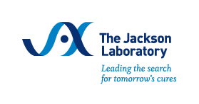
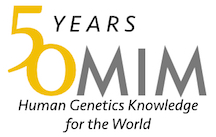

# HPO Community

The HPO has been a community project since its inception in 2008. We are indebted to all those who have made contributions of new terms, annotations, and other improvements.

## Organizational

|  |  |  |  |  |
|  |  |  |  |  |

## Individual
# Monarch Initiative

The HPO is the clinical flagship of the [Monarch Initiative](https://monarchinitiative.org/){:target="_blank"}. Please see [here](https://monarch-initiative.github.io/monarch-documentation/) for documentation about other activities of the Monarch Initiative.