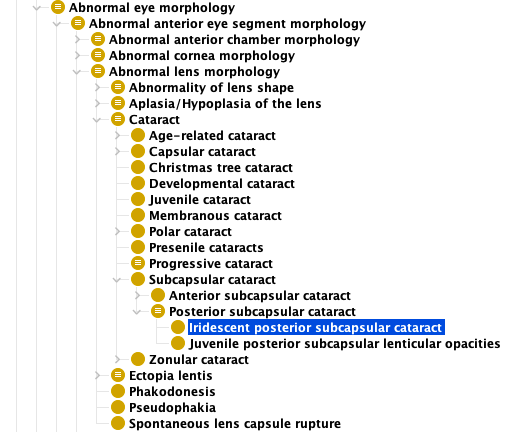
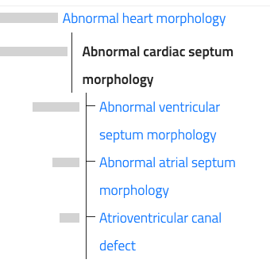
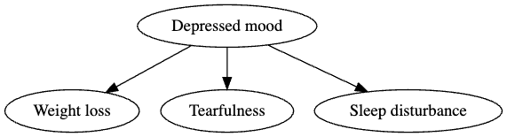

# Rules For Good HPO Structure

Creating a good HPO (see [here](good_term.md)) is not all we need to do. We also need to decide
where to place the term in the HPO hierarchy. There are several rules of thumb that can help with this.

## True-Path Rule
The true path rule (also known as annotation propagation rule) states:

  If a term can be used to describe a patient then all parents of that term can be used to describe that patient. 

<figure markdown>
{ width="600" }
<figcaption class="left-align"><b>Iridescent posterior subcapsular cataract</b>.
Hierarchy for Iridescent posterior subcapsular cataract (HP:0007889).
</figcaption>
</figure>

In this case, if a patient is diagnosed with 
[Iridescent posterior subcapsular cataract (HP:0007889)](https://hpo.jax.org/browse/term/HP:0007889){:target="\_blank"}, it is true that the patient can also be said to have [Posterior subcapsular cataract (HP:0007787)](https://hpo.jax.org/browse/term/HP:0007889){:target="\_blank"}, because every *Iridescent posterior subcapsular cataract* is also a *Posterior subcapsular cataract* (i.e., *Iridescent posterior subcapsular cataract* is a specific kind of *Posterior subcapsular cataract*). 

Similarly, the patient can be said to have a [Subcapsular cataract (HP:0000523)](https://hpo.jax.org/browse/term/HP:0000523) because every *Posterior subcapsular cataract* is also a *Subcapsular cataract*. The same thing is true of all of the ancesters, e.g., the patient can be said to have a 
[Cataract (HP:0000518)](https://hpo.jax.org/browse/term/HP:0000518){:target="\_blank"} and 
[Abnormal lens morphology (HP:0000517)](https://hpo.jax.org/browse/term/HP:0000517){:target="\_blank"} and so on up to the root of the ontology, [Phenotypic abnormality (HP:0000118)](https://hpo.jax.org/browse/term/HP:0000118){:target="\_blank"}.

## When is the true-path rule violated?

Consider the following example. Currently, in the HPO, [Cataract (HP:0000518)](https://hpo.jax.org/browse/term/HP:0000518){:target="\_blank"} is a subclass of 
[Abnormal lens morphology (HP:0000517)](https://hpo.jax.org/browse/term/HP:0000517){:target="\_blank"}. This is always true for reasons explained above. Let's say we decided to make 
[Cataract (HP:0000518)](https://hpo.jax.org/browse/term/HP:0000518){:target="\_blank"} also be a subclass of [Reduced visual acuity (HP:0007663)](https://hpo.jax.org/browse/term/HP:0007663){:target="\_blank"}
because individuals with cataract tend to have vision problems.

This would violate the true-path rule, because it is not true that all individuals with cataract have reduced visual acuity. Rarely, visual acuity can be normal with certain kinds of congenital cataract. However, HPO-based software uses the true-path rule to infer that if a patient is explicitly annotated to a certain term, the patient is implicitly annotated to all of the ancestors of the term, which would not always be true in this example.

## Avoid bundled terms

Avoid creating terms that refer to multiple phenotypes that do not easily fit under a broader term.

For example, a concept such as "Bipolar disease I" is not a good HPO term because it is a diagnostic term that refers to an individual with a history of at least one manic episode who displays the following characteristics:

<table class="alt-rows-table">
  <thead>
    <tr>
      <th>Label</th>
      <th>Description</th>
    </tr>
  </thead>
  <tbody>
    <tr>
      <td><b>A</b></td>
      <td>Distinct period of mood disturbance</td>
    </tr>
    <tr>
      <td><b>B</b></td>
      <td>Manic symptoms</td>
    </tr>
    <tr>
      <td><b>C</b></td>
      <td>Severe mood disturbance</td>
    </tr>
    <tr>
      <td><b>D</b></td>
     <td>Not attributable to a substance or other medical condition</td>
    </tr>
  </tbody>
</table>

<strong>Table 1</strong>: Criteria for bipolar disease I.

To specify a disease, it is preferable to use a term from a disease ontology such as Mondo.

### Exceptions

Many Mendelian diseases are characterized by a highly increased risk for certain diseases. For instance, individuals with Bardet-Biedl syndrome frequently have [Diabetes mellitus (HP:0000819)](https://hpo.jax.org/browse/term/HP:0000819){:target="\_blank"}. Frequently, this is the only information that is available in medical publications (e.g., it would be noted that a person with BBS has diabetes, but the manifestations and time course of diabetes in that individual are not specified). For this reason, the
HPO has a number of "diagnostic" terms. 

Also, in some cases, a medical history of a disease can be considered to be a phenotypic feature. For instance, infections following live vaccinations such as [BCGosis HP:0020087](https://hpo.jax.org/browse/term/HP:0020087){:target="\_blank"}  can be manifestations of some inborn errors of immunity.

## Pie rule
The Pie Rule (also known as the Brie rule) states:

The set of child terms of a given term should robustly cover the specific subclasses of the parent term, such that a parent term could always be replaced with a more specific child term. 

<figure markdown>
{ width="200" }
<figcaption class="left-align"><b>Pie rule</b>.
If a term has one or more subclasses, then ideally the subclasses should be about the same "size" and completely cover the pie.
</figcaption>
</figure>

Consider, for instance, the term [Abnormal cardiac septum morphology (HP:0001671)](https://hpo.jax.org/browse/term/HP:0001671){:target="\_blank"}.

<figure markdown>
{ width="300" }
<figcaption class="left-align"><b>Abnormal cardiac septum morphology</b>.
</figcaption>
</figure>

Abnormal cardiac septum morphology has three subterms. On the HPO website, if you hover over the gray bars, you can see the number of descendent terms for each of them.

- [Abnormal ventricular septum morphology (HP:0010438)](https://hpo.jax.org/browse/term/HP:0010438){:target="\_blank"}: 14 subterms, including specific terms such as [Perimembranous ventricular septal defect HP:0011682](https://hpo.jax.org/browse/term/HP:0011682){:target="\_blank"}.
- [Abnormal atrial septum morphology (HP:0011994)](https://hpo.jax.org/browse/term/HP:0011994){:target="\_blank"}: 8 subterms, including specific terms such as [Secundum atrial septal defect (HP:0001684)](https://hpo.jax.org/browse/term/HP:0001684){:target="\_blank"}
- [Atrioventricular canal defect (HP:0006695)](https://hpo.jax.org/browse/term/HP:0006695){:target="\_blank"}: 6 subterms, including specific terms such as [Complete atrioventricular canal defect (HP:0001674)](https://hpo.jax.org/browse/term/HP:0001674){:target="\_blank"}.

Thus, here the HPO attempts to cover all of the specific kinds of *Abnormal cardiac septum morphology*.
The three main subclasses are covered and all three have roughly the same number of terms. It would be a mistake, in contrast, if [Abnormal cardiac septum morphology (HP:0001671)](https://hpo.jax.org/browse/term/HP:0001671){:target="\_blank"} had the subclasses 
[Abnormal ventricular septum morphology (HP:0010438)](https://hpo.jax.org/browse/term/HP:0010438){:target="\_blank"}, [Abnormal atrial septum morphology (HP:0011994)](https://hpo.jax.org/browse/term/HP:0011994){:target="\_blank"}, and then [Complete atrioventricular canal defect (HP:0001674)](https://hpo.jax.org/browse/term/HP:0001674){:target="\_blank"}, [Partial atrioventricular canal defect (HP:0011577)](https://hpo.jax.org/browse/term/HP:0011577){:target="\_blank"}, and so on for the other four child terms of [Atrioventricular canal defect (HP:0006695)](https://hpo.jax.org/browse/term/HP:0006695){:target="\_blank"}, because the former two terms have a different granularity (they are grouping terms) than the latter (they are specific terms).

## The 5 o-clock rule
This rule states that 

Terms should be easy to find by walking down the hierarchy. That is, a clinician should be able to find the right term at 5:00 pm on a Friday after a long work week.

It is of course hard to precisely define this rule, but basically the hierarchy of the HPO should reflect, to the extent possible, current clinical thinking and not ontological abstractions.

# Why are these rules important?

Consider the following (made-up) example. At first glance, it may appear correct - after all, patients with depressed mood may lose weight, be tearful, and have sleep disturbances.

<figure markdown>
{ width="400" }
<figcaption class="left-align"><b>Example: depressed mood</b>.
</figcaption>
</figure>

However, note that these are not actually **subclass** relations. Instead, they are **has-phenotype** relations in the sense that a patient with depressed mood often has the three phenotypic features in question. However, not every patient with sleep distrubance has depressed mood. Other causes include
sleep apnea, restless Legs Syndrome, narcolepsy, chronic pain, certain medications, caffeine,  alcohol, environmental factors such as loud noises, thyroid conditions, parkinson disease, and many others.

Therefore, if we encoded this relation in the HPO (which only uses subclass relations), then HPO-aware computer programs would falsely conclude that every patient with any one of the above diseases who happened to have a sleep disturbance also has depressed mood. While this may be true for some, it is not true in general, and this would lead to erroneous results. 

The structure of the HPO is designed to follow the above rules to ensure accuracy of computational algorithms that use HPO.

