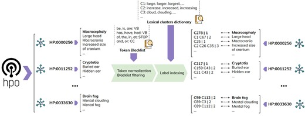

# Text mining

A variety of tools have been presented for mining texts for HPO terms (concept recognition). We present a selection here.

## FastHPOCR

FastHPOCR is a Python package a dictionary-based approach using a pre-built large collection of clusters of morphologically equivalent tokens—to address lexical variability and a more effective CR step by reducing the entity boundary detection strictly to candidates consisting of tokens belonging to ontology concepts. 

  

    
  

  [Groza T, et al (2024)  Bioinformatics 40:btae406](https://pubmed.ncbi.nlm.nih.gov/38913850/){:target="\_blank"}

