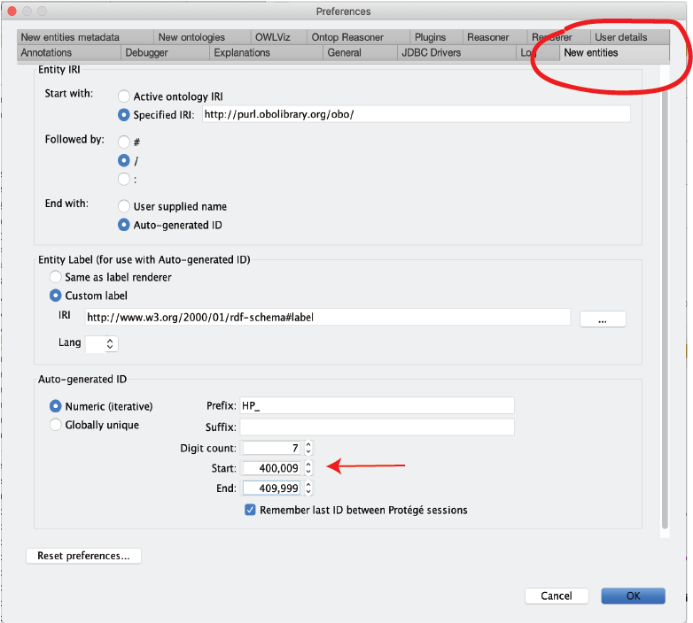
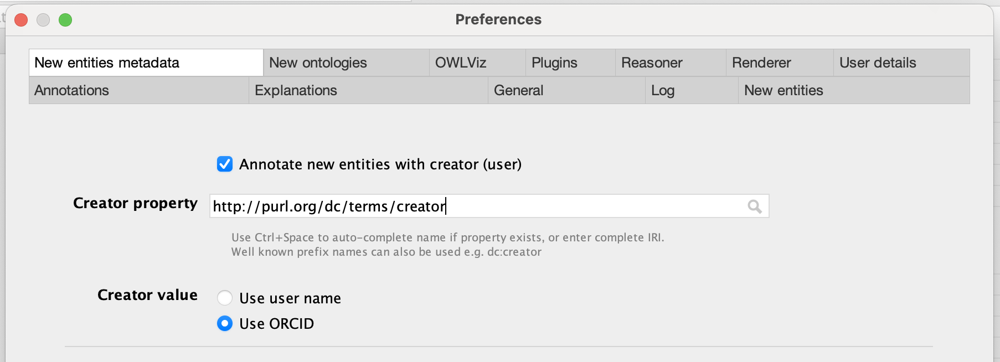

# Protege: Guide for HPO developers

[Protege](https://protege.stanford.edu/){:target="_blank"}  and [hpo2robot](https://github.com/monarch-initiative/hpo2robot){:target="_blank"}  are used to edit the *hp-edit.owl* file, from which all other HPO ontology files are generated. This document summarizes how to set up Protege for editing. The instructions are intended for HPO team members and anybody who is interested in how we do our work. Most users of the HPO do not need to understand these steps.

## Protege setup

Download Protege (at least version 5.5) from the [Protege download page](https://protege.stanford.edu/software.php#desktop-protege){:target="_blank"} .

If you would like to use the reasoner, download and install the [Elk plugin](https://github.com/liveontologies/elk-reasoner/wiki/GettingElk){:target="_blank"} : Put the plugin into the Protege/plugins directory, see instructions below.

## Setting your ID ranges

Do you have an ID range in the idranges file (hp-idranges.owl), in the src/ontology/ directory)? If not, Peter, Nicole, Chris or Melissa can add one for you.

Ensure that you have Protege configured to generate new URIs in your own range. Note that if you edit multiple files, you need to check this every time to ensure that the proper settings are in place. HP URIs should look like this: http://purl.obolibrary.org/obo/HP_0000473 Do a test to ensure that the ID generator is working properly.

A word of caution about protege auto-id functionality. Protege will allow reuse of a URI in your range according to the numbering scheme. It will keep track of what you did during last session, but does not check for use of the URI before assigning it (doh!!). Therefore, if you switched between editing another ontology, or added any IDs in your range prior to the switch to OWL, Protege will not know not to start from the beginning. Some tips below to check to see where you are in your range. Note: if you only edit the HPO and do not edit other ontologies, you will only need to set this up once, Protege will remember your last ID between sessions.

Open the file hp-idranges.owl in src/ontology in a text editor (like TextEdit) and check your ID range (start and end).
In Protege, go to the View menu, click "render by entity IRI short name (Id)". This will display classes as "HP_0030021" etc.

<figure markdown>
{ width="400" }
<figcaption><b>Setting up ID Range</b>.
Set up Protege to show term IDs instead of labels.
</figcaption>
</figure>

Use the search box to search for classes starting within your range, such as "HP_04" for Melissa's range. Check the "show all results" box to see all of your results.

<figure markdown>
{ width="600" }
<figcaption><b>Setting up the ID Range</b>.
Find the highest previously used HPO id in your range 
</figcaption>
</figure>

Find the last used ID in your range, e.g. HP_0400008.
Go to *Protege->Preferences*, and click the New Entities tab. Set Protege to the next unused ID in your range (e.g., "HP_00400009") rather than the beginning of the range.

<figure markdown>
{ width="600" }
<figcaption><b>Setting up ID Range</b>.
Entering correct settings for the ID range in Protege.
</figcaption>
</figure>

To do so (assuming you are using Protege 5), go to Protege->Preferences window and find the "New Entities" tab. The following settings are correct:

- Start with "Specified URI": http://purl.obolibrary.org/obo/
- Followed by "/"
- End with "autogenerated ID"
- Entity label "custom label": http://www.w3.org/2000/01/rdf-schema#label
- Autogenerated ID "numeric", prefix "HP_", digit count "7", start (nextunused ID in your range), end (last ID in your range)
- Finally, tick the box "remember last ID between Protege sessions"

For instance, Melissa's range is 0400000-0409999

Note that you can use ctrl-U to see the IRI of the current entity. If you click on "show full IRI", you should see something like this: http://purl.obolibrary.org/obo/HP_0011531.

Protege should then remember your last used ID on the computer you are currently using for next time, though you should double check.

(You can ignore this if you do not intend to create new classes)

## New Entities Metadata

Finally, go to Protege->Preferences, “New Entities Metadata” tab and set the following items. This will ensure that we are all using the same tag to get credit for making new terms.

- activate: ``Annotate new entities with creator (user)``. 
- Creator property: http://purl.org/dc/elements/1.1/creator
- Creator value: user ORCID (enter your ORCID id under User!)
- activate: ``Annotate new entities with data/time``.
- Date property: http://purl.org/dc/elements/1.1/date
- Date value format: ISO-8601

<figure markdown>
{ width="600" }
<figcaption><b>New entities metadata</b>.
Set up Protege to set up metadata for new entries.
</figcaption>
</figure>
