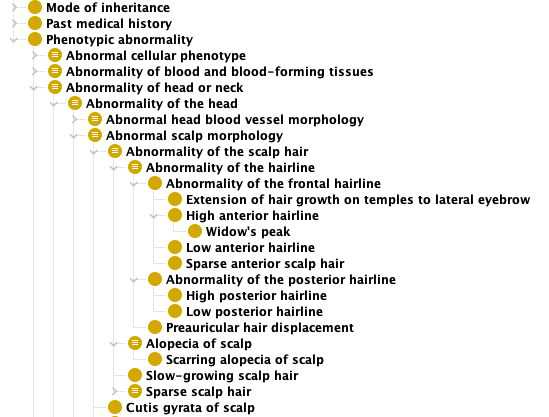
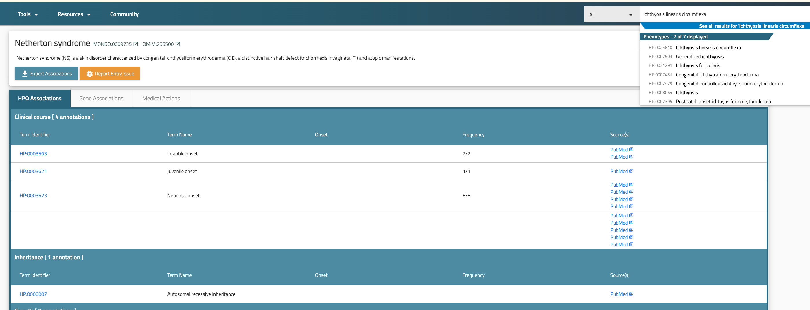

# Human Phenotype Ontology

## Quick Links

- :material-stethoscope: **Clinician’s Guide**  
  [Overview](clinicians/overview.md)

- :material-dna: **Annotations**  
  [HPO annotation file formats](annotations/introduction.md)

- :material-code-tags: **Developer Tools**  
  [Software libraries & utilities](developers/overview.md)

- :material-toolbox-outline: **HPO Software Tools**  
  [Tools for working with HPO](tools/overview.md)

- :material-file-document-multiple: **Phenopackets**  
  [Phenopacket standard](phenopackets/overview.md)

- :material-cogs: **Contributing to the HPO**  
  [New term requests, bug reports, workshops](contributing/index.md)

Human Phenotype Ontology (HPO) is an ontology used to describe human phenotypic abnormalities seen in genetic disorders and clinical research.
It provides a structured representation of abnormal characteristics associated with diseases.
HPO helps researchers and clinicians share and integrate phenotypic data, making understanding and diagnosing genetic disorders easier.
It uses a hierarchical organization and semantic relationships between terms and allows for annotation of genes and diseases. HPO is used in multiple diagnosis and variant prioritization tools, aiding healthcare professionals and researchers in identifying and classifying genetic conditions.
In 2023, HPO released an international edition which covers different languages such as Chinese, Turkish, Japanese, Spanish and Czech ([more](https://obophenotype.github.io/hpo-translations/)).
The translations are displayed in the various browsers (e.g. [HPO App](https://hpo.jax.org/browse/term/HP:0001166){:target="\_blank"} and [OLS](https://www.ebi.ac.uk/ols4/ontologies/hp){:target="\_blank"}).

This site contains documentation for clinicians, researchers, developers, and other users of the [HPO](https://hpo.jax.org/){:target="\_blank"}.

  

    
  

  

    
  

  A snapshot of the HPO hierarchy (left) and the HPO App (right).

To learn more, explore the [HPO app](https://hpo.jax.org/).
