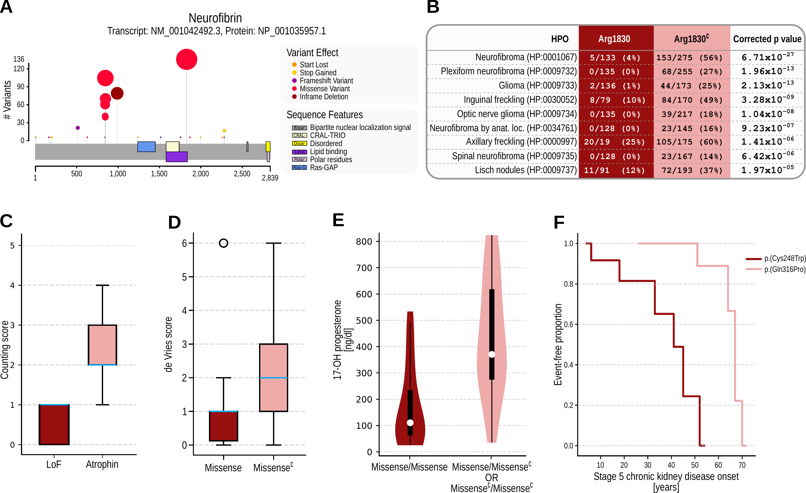

# HPO-related Applications of Phenopackets

## Using phenopackets for HPO-driven genomic diagnostics
 
Most current software packages for phenotype-driven diagnostic analysis of exome or genome sequence data accept phenopackets as input. See the [Tools page](../tools/overview.md) for details.

## Genotype-Phenotype Correlation Analysis

Genotype Phenotype Evaluation of Statistical Association (GPSEA), a software package that leverages the Global Alliance for Genomics and Health (GA4GH) Phenopacket Schema to represent case-level clinical and genetic data about individuals. GPSEA applies an independent filtering strategy to boost statistical power to detect categorical GPCs represented by Human Phenotype Ontology terms. GPSEA additionally enables visualization and analysis of continuous phenotypes, clinical severity scores, and survival data such as age of onset of disease or clinical manifestations. 

[:material-open-in-new: GitHub](https://github.com/P2GX/gpsea){ target="_blank" }
[:material-open-in-new: PubMed](https://pubmed.ncbi.nlm.nih.gov/40093222/){ target="_blank" }

  

    
  

