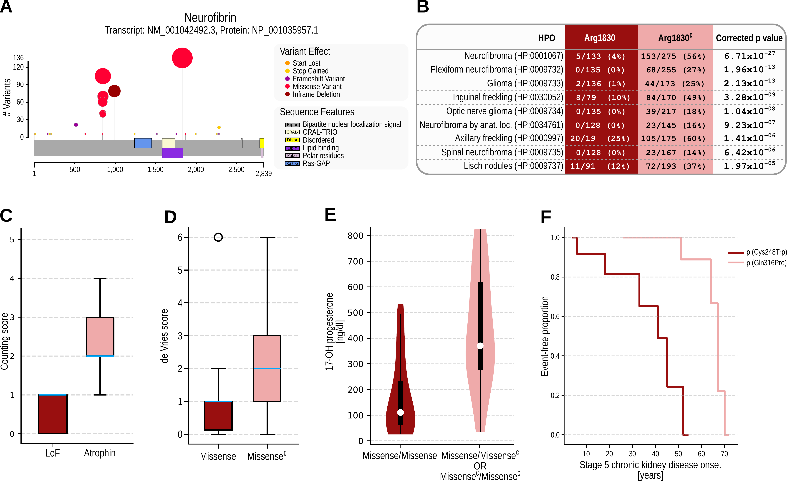
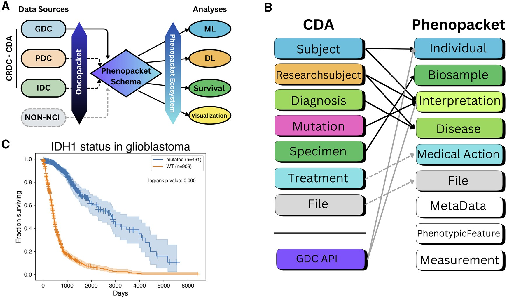

# HPO-related Applications of Phenopackets

A growing list of software packages are available for analyzing data stored in phenopacket format. Please let us know if you would like to suggest additions to the following entries.
See the [Developers](developers.md) page for additional software packages for constructing and validating phenopackets in Java, Python, and Rust.

## Using phenopackets for HPO-driven genomic diagnostics
 
Most current software packages for phenotype-driven diagnostic analysis of exome or genome sequence data accept phenopackets as input. 
These include

- [:material-open-in-new: Exomiser](https://pubmed.ncbi.nlm.nih.gov/24162188/){ target="_blank" }
- [:material-open-in-new: LIRICAL](https://pubmed.ncbi.nlm.nih.gov/32755546/){ target="_blank" }
- [:material-open-in-new: ClintLR](https://pubmed.ncbi.nlm.nih.gov/39396132/){ target="_blank" }
- [:material-open-in-new: Phen2Gene](https://pubmed.ncbi.nlm.nih.gov/32500119/){ target="_blank" }
- [:material-open-in-new: PhEval](https://pubmed.ncbi.nlm.nih.gov/40121479/){ target="_blank" } (Standarized benchmarking of HPO-based prioritization software)

## Clinical data entry/analysis platforms

- [:material-open-in-new: SAMS](https://pubmed.ncbi.nlm.nih.gov/35524573/){ target="_blank" } (Symptom Annotation Made Simple)
- [:material-open-in-new: TrialMatchAI](https://pubmed.ncbi.nlm.nih.gov/41876500/){ target="_blank" } (A clinical trial recommendation system)
- [:material-open-in-new: RareLink](https://pubmed.ncbi.nlm.nih.gov/41253795/){ target="_blank" } (A REDCap-based framework for rare disease interoperability linking international registries to FHIR and Phenopackets)
- [:material-open-in-new: Pheno-Ranker](https://pubmed.ncbi.nlm.nih.gov/39633268/){ target="_blank" } (Semantic similarity analysis of phenotypic data in Beacon v2 and Phenopackets v2 formats,)
- [:material-open-in-new: OMOP to Phenopacket Coversion](https://pubmed.ncbi.nlm.nih.gov/38777085/){ target="_blank" }
- [:material-open-in-new: Convert-Pheno](https://pubmed.ncbi.nlm.nih.gov/38035971/){ target="_blank" } (Interconversion of common data models for phenotypic data such as Beacon v2 Models, CDISC-ODM, OMOP-CDM, Phenopackets v2, and REDCap)

 

## Genotype-Phenotype Correlation Analysis

Genotype Phenotype Evaluation of Statistical Association (GPSEA), a software package that leverages the Global Alliance for Genomics and Health (GA4GH) Phenopacket Schema to represent case-level clinical and genetic data about individuals. GPSEA applies an independent filtering strategy to boost statistical power to detect categorical GPCs represented by Human Phenotype Ontology terms. GPSEA additionally enables visualization and analysis of continuous phenotypes, clinical severity scores, and survival data such as age of onset of disease or clinical manifestations. 

[:material-open-in-new: GitHub](https://github.com/P2GX/gpsea){ target="_blank" }
[:material-open-in-new: PubMed](https://pubmed.ncbi.nlm.nih.gov/40093222/){ target="_blank" }

  

    
  

## Oncopacket: integration of cancer research data using GA4GH phenopackets
This software package shows how to integrate  demographic, mutation, morphology, diagnosis, intervention, and survival data using case data from the National Cancer Institute for 12 cancer types. It demonstrates how phenopacket-encoded data can be used by recapitulating a known association between mutations in the gene encoding isocitrate dehydrogenase 1 and survival time in brain cancer patients.

[:material-open-in-new: GitHub](https://github.com/monarch-initiative/oncopacket){ target="_blank" }
[:material-open-in-new: PubMed](https://pubmed.ncbi.nlm.nih.gov/41017641/){ target="_blank" }

  

    
  

