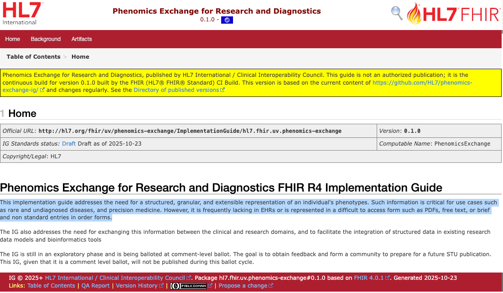

# Phenomics Exchange for Research and Diagnostics

[FHIR – Fast Healthcare Interoperability Resources](https://hl7.org/fhir/){:target="\_blank"} is a standard for health care data exchange, published by HL7.

FHIR implementation guides are created to define how the capabilities defined by the FHIR specification are used in particular data exchanges, or to solve particular problems. An implementation guide is under development to represent the
GA4GH Phenopacket Schema in EHR seetings. It addresses the need for a structured, granular, and extensible representation of an individual's phenotypes. Such information is critical for use cases such as rare and undiagnosed diseases, and precision medicine. 

 [:material-open-in-new: FHIR IG](https://build.fhir.org/ig/HL7/phenomics-exchange-ig/en/){ target="_blank" }

  

    
  
