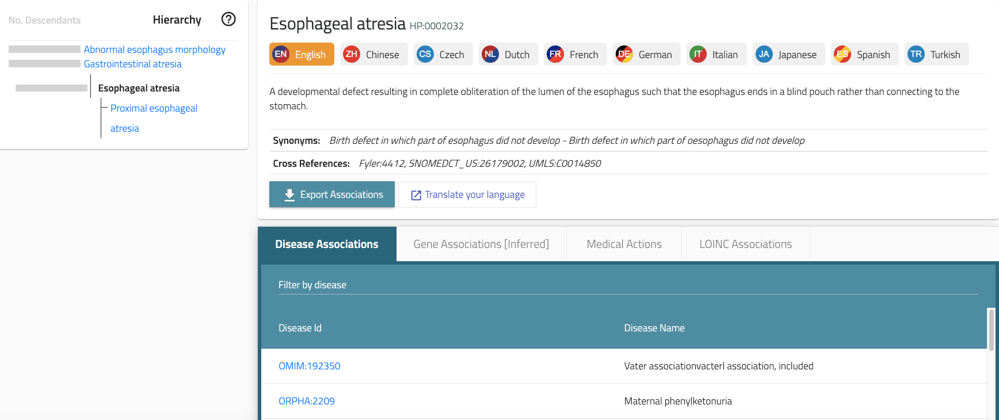

# Workshop procedure

Each HPO workshop is a little different, but in general, we plan for one or two days. Usually, the schedule of a workshop resembles the following plan.

1. Lecture. Review of the HPO project and its applications in genomic diagnostics and translational research. (60 min)
2. Review of the rules for making new HPO terms (see the other pages in this section). (30min)
3. Discussion and demonstration of tools for the workshop. Depending on the setting, we have used Google spreadsheets, online forms (airtable), or pencil and paper to capture the suggestions of workshop participants. This is because different projects and different groups are at different stages and have distinct goals. 
4. Group session. We typically start with a session involving the entire group in which we review a small section of the HPO and create 3-5 terms together, so that participants gain confidence in working with the HPO.
5. Breakout sessions. We typically ask groups to identify subtopics for smaller breakout groups (of 3-10 members). These groups will review the relevant part of the HPO in depth, creating new terms, revising and improving existing terms and structure.
6. Report-back. The breakout groups report to the group as a whole, and if necessary, revisit the terms created in the breakouts according to suggestions of the group.
7. Hand-off. The breakout groups usually define a group leader who coordinates the remaining work with the HPO team. For instance, the HPO term will plan to add the new terms to the official HPO files using either scripts or adding some terms manually using tools such as Protege.

# Getting started

In our experience, it takes first-time participants a few hours to get the hang of things. This is OK, and the HPO project is insensely grateful to its many contributors for taking the time to help us improve the resource -- we will take enough time during the workshops to discuss questions and doubts.

This section provides an example of the kind of work you will be doing.

<figure markdown>
{ width="1000" }
<figcaption class="left-align"><b>Esophageal atresia</b>.
Hierarchy for Iridescent posterior subcapsular cataract (HP:0007889).
</figcaption>
</figure>

At the time of this writing (Nov. 24, 2024), the term [Esophageal atresia (HP:0002032)](https://hpo.jax.org/browse/term/HP:0002032){:target="\_blank"} has only one child term, [Proximal esophageal atresia (HP:0004403)](https://hpo.jax.org/browse/term/HP:0004403){:target="\_blank"}. The latter term has no definition, no citation to an article in PubMed, and no synonyms. Therefore, several rules described in the sections on [good HPO structure](good_structure.md) and [good HPO term content](good_term.md) are violated, and so there is ample opportunity to improve this part of the HPO. 

When you are considering whether a term needs work, reflect on the following issues.

<ol>
    <li>Do the children of the term include all relevant concepts? Is the granularity of the child terms similar? (Pie rule)</li>
    <li>Do you need to create a new term? (also Pie rule)</li>
   <li>Is the structure (or relationships between terms) correct? (True path rule)</li>
   <li>Do you need to add more synonyms?</li>
  <li>Could the label or definition of a term use some added clarification? (5 o'clock rule)</li>
</ol>

In this case, here are some of the things we could do.

## Add a definition

We can search in PubMed using a search term such as <tt>"esophageal atresia"[title]</tt>. If we search in Google, it is good to search on <tt>"esophageal atresia" AND PMID</tt> in order to find an article listed in PubMed which we can cite in the HPO.

One of the articles that this search turned up was [Sfeir R, et al. (2013) Epidemiology of esophageal atresia. Dis Esophagus 26(4):354-5](https://pubmed.ncbi.nlm.nih.gov/23679022/){:target="\_blank"}. We can extract the first two sentence from the abstract of this article for our definition:

Esophageal atresia (EA) is a rare congenital malformation consisting of a lack of continuity between the upper and lower esophageal pouches, frequently associated with tracheoesophageal fistula.

It is acceptable to use large-language models as a part of the search process, but we ask that all definitions are derived from a citable source and that a human expert has vetted the source and the definition.

# Add synonyms

Synonyms are useful because they help users more easily find HPO terms and they are also used by most text-mining tools that identify HPO terms in texts. This is an application where LLMs can be very useful if the answers are checked by an expert. In this case, GPT suggested "Esophageal agenesis", which is not a synonym (agenesis means complete absence, while atresia means that the esophagus ends in a blind pouch instead of connecting to the stomach). However, "Esophagus atresia" is correct.

# Add related terms

We may decide to add more child terms to [Esophageal atresia (HP:0002032)](https://hpo.jax.org/browse/term/HP:0002032){:target="\_blank"}. It is often good to search for information about classifications of defects or abnormalities. In this case, we find a review article on the anomaly: [Spitz L (2007) Oesophageal atresia. Orphanet J Rare Dis. 2:24](https://pubmed.ncbi.nlm.nih.gov/17498283/){:target="\_blank"}.

In our workshops, often participants will be aware of the classifications most used in their field and are able to specify the key citations. We ask participants to prepare themselves for our workshop by identifying analogous classifications in their field that are relevant for the topics to be worked on.

Here, we see that there are several common anatomical types of oesophageal atresia. 

- Esophageal atresia with distal tracheooesophageal fistula
- Esophageal atresia without tracheooesophageal fistula 
- H-type tracheooesophageal fistula (4%)

The first category is the most common variety in which the proximal oesophagus, which is dilated, and the muscular wall thickened ends blindly in the superior mediastinum at about the level of the third or fourth thoracic vertebra. We may need to relabel this terms to reflect this, i.e., to change the label of 
[Proximal esophageal atresia (HP:0004403)](https://hpo.jax.org/browse/term/HP:0004403){:target="\_blank"} to *Esophageal atresia with distal tracheooesophageal fistula*. If we are not sure if these are refering to the same medical entity, we would leave the original term and add a corresponding definition.
Typically, there is group discussion about such issues.

# Disease annotations

Ideally, we would also collect information about case or cohort reports that describe Mendelian diseases that can be characterized by Esophageal atresia. We can start by looking at the Disease annotations tab of the correpsonding page on the HPO website: [Esophageal atresia (HP:0002032)](https://hpo.jax.org/browse/term/HP:0002032){:target="\_blank"}. If we know of a disease that has this association but is not listed there, we can add the information by creating an issue on the GitHub tracker or directly during the workshop.